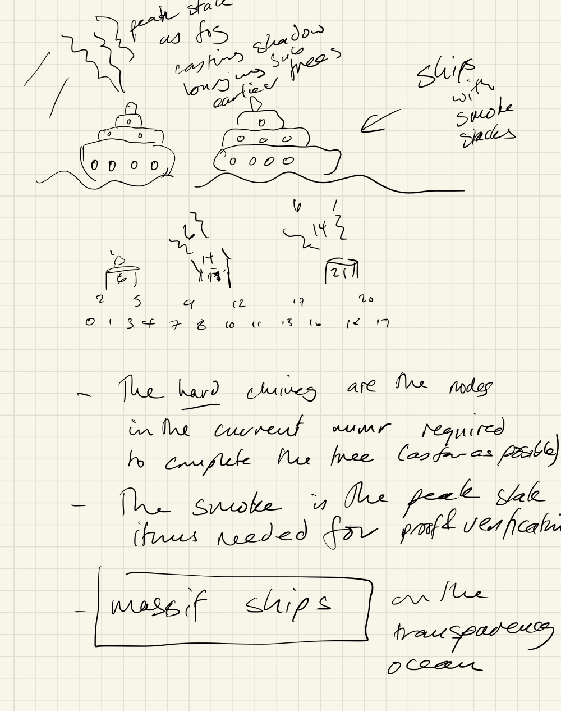

# If You Go Down To The Woods Today.


To setup the "surprise", lets start with a trick question: How many roots do I need in my life ?

If you are reading that as "square root", this article isn't the droid you are looking for. If you are reading it as in "route 66", then you are definitely quite far off course. If you naturally thought the top most node in a Merkle tree, this article might indeed be for you. But everyone else, hang in there if you can, you benefit from the outcome of this kind of thing every time you visit a website that has a padlock icon in your web browser. And as trusting data - how it was made, where it has been and what it says - becomes not just a "nice to have", but rather an urgent and necessary component of digital networks, this is the kind of article to read if you really want to take the lid off how your data is made safe to use.

So now we are talking about Merkle tree roots and the link between the woods and trees is hopefully established, I can do the reveal: You don't want a root, you want an accumulator. While Merkle tree roots change with every addition, an accumulator can be thought of as a more durably useful commitment to entries being included in the tree (“proof of inclusion”). And of entries continuing to be "consistently" included as the tree evolves.

An accumulator is useful forever as is, and even where you need a fresh one, you don't need to update it very often. "Mono" roots change with every addition and that is frustrating in many ways. As we will see, a very useful accumulator can be made directly from a merkle tree as it grows - if we change how we deal with the incomplete sub trees.

The affordances of asynchronous cryptographic accumulators are a large part of why, for transparency logs, I prefer an alternate, but I feel complimentary, construction to the classic merkle tree scheme established by RFC9162[^6]

The easiest way to get such an accumulator I know of is by using a Merkle Mountain Range.

Merkle Mountain Ranges (MMR) are attributed to Peter Todd [^1], and which have also been described variously as "history trees" [^2], "post order storage layout"[^3] and "binary numeral trees"[^4]. They naturally provide the "cryptographic asynchronous accumulator" described in [^5]. They largely stem from the observation that flat base trees are both more manageable and more efficient to deal with than other constructions - such as the semi stable "not flat base" merkle trees described in  RFC9162[^6]

There are significant similarities. Essentially MMR's are equivalent to the incomplete sub trees in Certificate Transparency (CT) binary Merkle trees, and differ only in how a single root is produced. MMR's use an algorithm to "bag the incomplete peaks" rather than adding temporary siblings to the tree that later need to be updated (re-written). This difference means CT merkle trees are not write once with respect to underlying storage but MMR's are. It also means that some portion of the CT Merkle Trees need to be re-built in ram (cached or otherwise) before additions can take place, while for MMR's the correct position to place the next node when adding leaves is always the very end of the log.

It turns out that for MMR's the accumulator is actually just the list of incomplete sub tree peaks but spaced out according to the bit positions implied by the *height* of the sub tree. We will get into some illustrative examples further down.

This means that much of the proving and verification will be at least familiar to practitioners already acquainted with CT Merkle Trees. In fact, at certain points in the tree evolution (perfect powers of 2 sizes), both the logs and the proofs are identical. Here, I'm going to propose that while the differences are relatively minor in form and syntax, they offer significant advantages to verifiers, monitors, and auditors. And so deserving of a position alongside CT-style Merkle trees in the transparency canon. To that end I've submitted the [MMRIVER](https://www.ietf.org/archive/id/draft-bryce-cose-merkle-mountain-range-proofs-00.html) profile to the IETF. MMRIVER specifies a Verifiable Data Structure for the [COSE Receipts](https://www.ietf.org/archive/id/draft-ietf-cose-merkle-tree-proofs-07.html) proposed registry. 


[^1]: https://lists.linuxfoundation.org/pipermail/bitcoin-dev/2016-May/012715.html
[^2]: https://static.usenix.org/event/sec09/tech/full_papers/crosby.pdf
[^3]: https://research.swtch.com/tlog#appendix_a
[^4]: https://eprint.iacr.org/2021/038.pdf
[^5]: https://eprint.iacr.org/2015/718.pdf
[^6]: https://datatracker.ietf.org/doc/html/rfc9162
[^7]: https://www.ietf.org/archive/id/draft-bryce-cose-merkle-mountain-range-proofs-00.html

Let's loosely define a receipt as everything you need to verify the inclusion of an entry in a log. An entry can be any arbitrary content. It could be a certificate, a picture of your cat, or a hash of the content stored in an existing storage service. For whatever reason, you want the ability to prove it existed. You may need to show it existed at a specific point in time, or demonstrate its general ordering with respect to other records or statements in a series. Here, to highlight both the similarities and differences with CT Merkle Trees, focusing on the basic existence proofs is sufficient. We are not going too delve deeply into the notions of total ordering in the global sense in this article (or not very much, anyway).

With an MMR/accumulator based receipt we can make a promise:

Once verified, a receipt is useful forever. You don't need to keep it forever, but if you have it, you can do useful things with it.

This follows from two specific properties of the accumulator:

Property 1: If you have obtained a verifiable receipt for an item once, you can then be offline indefinitely. When you come back online, a fresh receipt for the same entry will verify against the state in the historic receipt. If it doesn't verify, you have proof that the log service is broken or lying.

Property 2: The receipt I have will be verifiable against future states for a well-defined time. With each update of the receipt, its "verifiability" time doubles. Here, "time" is an approximation; specifically, it is the number of additions to the log after the entry that counts.

These properties are defined formally as "Low Update Frequency" and "Old-Accumulator Compatibility" in [^5]

Taking these together, we can see that there is no requirement for "keeping up to date." Because of Property 1, even if my receipt has become outdated, I am guaranteed that the new receipt will verify against the material in the stale receipt. And if it doesn't, I can prove the log is lying.  And because of Property 2, if I am concerned that the log service may "go away", preventing access to the fresh log data necessary to show my historic receipt continues to be included in the log, I know there is a low, and ever-decreasing, rate at which an accumulator update will require path extension for my historic receipt.

While it is possible to "wake up" and refresh any receipts you particularly care about and check them one by one, you don't need to do so. Instead, ask for a consistency proof between the most recent accumulator you have verified and the log's current accumulator state. In series, the consistency proofs will contain exactly those nodes you require to freshen any of your historic receipts. So you don't actually, need to freshen them. You just need a chain of consistency proofs from a trusted source.

You also reveal nothing about the entries you are particularly interested in when asking for the current accumulator state.

Lastly, because of the stability of the material in the log—due to the "flat base" property—we are able to publish it to publicly and anonymously accessible storage within milliseconds of your entry being added. The log material is strictly both append-only and write-once. Replication of the log, or of well-defined chunks of it, is straightforward.

Every section of the log can be covered by a signature that attests to the entire historic state using a single conventional root. The root is computed according to the MMR "peak bagging" algorithm. The bagged peaks are, in fact, precisely the non-empty nodes of the accumulator at that time. A signature over an accumulator is then equivalent to, and also more useful than, a signature over the tree head.

In fact, rather than "bagging", it is advantageous to instead sign the list of peaks and also the individual peaks in that list.

If instead we individualy sign the peaks *and* the accumulator (list of peaks), we are, in effect *pre-signing* the receipts for all entries in the log up to that point. It is not necessary or even helpful to sign the proof material. The signature is always over the result of the proof. With accumulator based receipts those results are no longer unique for each addition: Only the *proofs* are unique and those are not signed.

This works because while the accumulator state is unique for each addition, the peaks in it change less and less often as the log grows.

If you have captured such an attestation, any archived copy of the log you obtained before that point is just as good (provable) as any other copy.  While the log is not intrinsically distributed, its write-once property makes it very very easy for any interested party to replicate it.  This same replication-friendly property also has significant benefits for the log operator's storage management burden and, in general, for monitors and auditors. It seems likely to me that these benefits alone are reason enough to adopt the scheme.

And using accumulator based receipts, the burden of receipt production can be both defered and have a better privacy posture: given a set of signed peaks, any party in posession of a section of log can self serve attested proofs for elements of interest.

To explain these properties, I'm going to walk through the definition of an asynchronous cryptographic accumulator purely in terms of its material impact on CT style Merkle Tree inclusion proofs.

But first, let's take a short detour to convince you there isn't a gotcha in terms of accumulator size or management.

## How big can accumulators get ?

The short answer is: strictly no bigger than a proof of inclusion for any single item in the tree.

The last time I checked, [Merkle Town](https://ct.cloudflare.com/) indicated a global issuance rate of ~450 thousand certificates per hour.

Now while the expiry rate was close behind, giving a net log growth of 30k/hour, for a continuous tree, it is the issuance rate that matters. It defines the rate of height growth for the tree. This doesn't improve as a result of clever log pruning. Only chaining physical logs together in logical logs can put a dent in that for Merkle trees.

Infact, and probably because of this, all known certificate transparency logs are already freezing historic ranges of the log and requiring that the client uses the notBefore and notAfter properties on the certificate to figure out which "physical log" in the "logical log" to check.

The maximum height of the tree is a crucial property because it determines the proof length. Sometimes, as we will see, it only defines the maximum proof length, but regardless it is the maximum we need to cope with.

So, given a Merkle log implementation that uses a 64-bit unsigned integer counter for its total count of nodes (leaves and interiors), how long before Merkle town says it is full?

We can say that is

```math
\frac{2^{64}}{450,000 * 24 * 365}
```

which is roughly 4.6 million *milenia*. It would be nice to think that the use of verifiable data in the world would increase enough for that limit to matter in practice. And even were that to happen, all other advances being equal, physical vs logical logs is still a perfectly satisfactory approach.

Even so, the accumulator for that very far future tree will still only be 64 entries long.

Such a log would still need to be capable of adding 125 certificates every second (for quite a long time!). That's about 8ms per addition, and we are still "only" talking about the total digital certificate issuance globally. It doesn't seem remotely feasible that "trust in all data" can be accomplished using a single log. And this suggests to me that logs that are easy to replicate and / or operate in a sharded manner will have the advantage.

In short, I don't believe there are any hidden gotcha's with MMR's and accumulators.

## Ok, how different is an MMR based Verifiable Data Structure versus CT Merkle Trees ?

Or, in otherwords, how much divergence from CT style VDS algorithm RFC9162_SHA256, as referenced in the draft [draft-ietf-cose-merkle-tree-proofs](https://datatracker.ietf.org/doc/draft-ietf-cose-merkle-tree-proofs/) do we need to get these properties ?

I believe enough to warrant a [supplemental entry](https://www.ietf.org/archive/id/draft-bryce-cose-merkle-mountain-range-proofs-00.html) for that registry, but close enough that the entry should be quite familiar to consumers of CT logs.

To illustrate this I'm going to work through the ASCI example from the section on [consistency proofs in RFC9162](https://datatracker.ietf.org/doc/html/rfc9162#section-2.1.5).  I'm going to consider inclusion proofs first as they set the scene for consistency proofs and a discussion of the accumulator evolution.

```
            hash
           /    \
          /      \
         /        \
        /          \
       /            \
      k              l
     / \            / \
    /   \          /   \
   /     \        /     \
  g       h      i      j
 / \     / \    / \     |
 a b     c d    e f     d6
 | |     | |    | |
d0 d1   d2 d3  d4 d5
```


Same tree evolving over steps

```

  (step 0)       (step 1)
  hash0          hash1=k
    / \              /  \
   /   \            /    \
  /     \          /      \
  g      c         g       h
 / \     |        / \     / \
 a b     d2       a b     c d
 | |              | |     | |
d0 d1            d0 d1   d2 d3

          (step 2)                 (step 3)
          hash2                    hash
          /  \                    /    \
         /    \                  /      \
        /      \                /        \
       /        \              /          \
      /          \            /            \
     k            i          k              l
    / \          / \        / \            / \
   /   \         e f       /   \          /   \
  /     \        | |      /     \        /     \
 g       h      d4 d5    g       h      i      j
/ \     / \             / \     / \    / \     |
a b     c d             a b     c d    e f     d6
| |     | |             | |     | |    | |
d0 d1   d2 d3           d0 d1   d2 d3  d4 d5
```

## Lets walk through how the proofs evolve

To illustrate both the similarities and the scope of the differences, lets look at how both the trees and the inclusion proofs for each scheme evolve using the example from RFC9162 as our basis.

For a deeper, but much less friendly, comparison which considers the sunlight tiles approach see [1d-2d-tree-equivalences](https://github.com/robinbryce/draft-bryce-cose-merkle-mountain-range-proofs/blob/main/1d-2d-tree-equivalences.md)

### Considering inclusion proofs

In preference to how MMRs are typically labeled, we retain the same node labeling as used in the RFC. This more clearly shows the path equivalences between the MMR construction and the Merkle Tree scheme in RFC9162. The differences lie exclusively in how the incomplete subtrees are dealt with.

Final trees after all three steps will be

```
      MMR                  |            CT Merkle Tree
                           |
                           |            hash          
                           |            /    \         
                           |           /      \        
                           |          /        \       
                           |         /          \      
                           |        /            \     
      k                    |       k              l    
     / \                   |      / \            / \   
    /   \                  |     /   \          /   \  
   /     \                 |    /     \        /     \ 
  g       h      i         |   g       h      i      j 
 / \     / \    / \        |  / \     / \    / \     | 
 a b     c d    e f     j  |  a b     c d    e f     d6
 | |     | |    | |     |  |  | |     | |    | |       
d0 d1   d2 d3  d4 d5    d6 |  d0 d1   d2 d3  d4 d5     
```

#### step 0 (3 leaves)     
   
```
      MMR                  |   CT Merkle Tree
                           |
                           |   hash0    
                           |     / \    
                           |    /   \   
                           |   /     \  
  g                        |   g      c 
 / \                       |  / \     | 
 a  b    c                 |  a b     d2
 |  |    |                 |  | |       
d0  d1  d2                 | d0 d1      
                           | 
local paths for d0, d2     | 
                           | 
d0: [b] -> g               | d0: [b, c] -> hash0 
d2: [] -> c                | d2: [g] -> hash0    
                           |
accumulator: [g, c]
```

#### step 1 (add 1 leaf, giving 4)

```
     MMR                   |      CT Merkle Tree
                           |
      k                    |      k = hash1
     / \                   |     /  \      
    /   \                  |    /    \     
   /     \                 |   /      \    
  g       h                |   g       h   
 / \     / \               |  / \     / \  
 a  b   c   d              |  a b     c d  
 |  |   |   |              |  | |     | |  
d0  d1  d2  d4             | d0 d1   d2 d3 
                           |
d0: [b, h] -> k            | d0: [b, h] -> hash1 = k
d2: [d, g] -> k            | d2: [d, g] -> hash1 = k

accumulator: [k]
```

Note that the accumulator resets every perfect power of 2, and all previous roots get "buried". And that at these points the CT Merkle Tree and the MMR are identical in both structure and in the proofs. This may suggest a way to transition a log from CT Merkle Tree to the MMR construction or visa versa. Also it may be possible to merge one into the other because of this. This property is recursive in nature, so it might be possible to apply *between* perfect peaks too.

#### step 2 (add 2 leaves, giving 6)

```
     MMR                      |            CT Merkle Trees
                              |
                              |
                              |             hash2
                              |             /  \
                              |            /    \
                              |           /      \
                              |          /        \    
                              |         /          \   
      k                       |        k            i  
     / \                      |       / \          / \ 
    /   \                     |      /   \         e f 
   /     \                    |     /     \        | | 
  g       h      i            |    g       h      d4 d5
 / \     / \    / \           |   / \     / \          
 a b     c d    e f           |  a b     c   d          
 | |     | |    | |           |  | |     |   |          
d0 d1   d2 d3  d4 d5          | d0 d1   d2   d3        
                              |
d0: [b, h] -> k               | d0: [b, h, i] -> hash2
d2: [d, g] -> k               | d2: [d, g, i] -> hash2
                              |
accumulator (d4): [k, _, e]   |
accumulator (d5): [k, i, _]
```

#### step 3

```
     MMR                      |            CT Merkle Trees
                              |
                              |
                              |             hash           
                              |            /    \          
                              |           /      \         
                              |          /        \        
                              |         /          \       
                              |        /            \      
      k                       |       k              l     
     / \                      |      / \            / \    
    /   \                     |     /   \          /   \   
   /     \                    |    /     \        /     \  
  g       h      i            |   g       h      i      j  
 / \     / \    / \           |  / \     / \    / \     |  
 a b     c d    e f     j     |  a b     c d    e f     d6 
 | |     | |    | |     |     |  | |     | |    | |        
d0 d1   d2 d3  d4 d5    d6    |  d0 d1   d2 d3  d4 d5      
                              |
d0: [b, h] -> k               |  d0: [b, h, l] -> hash 
d2: [d, g] -> k               |  d2: [d, g, l] -> hash 
                              |
accumulator: [k, i, j]        |

```

Notice how the nodes i and l are temporarily included in the witnesses for d0 and d2 at steps 2 and 3. Once frozen nodes are included, they never change but until that happens, they are subject to re-writes and the witnesses are not subsets of their successors.

So even though parts of the witnesses becomes stable, they are always bound permanently to a single root. They are not forward compatible with future roots "as is".

With history trees/post order/MMR's, only the "frozen" nodes exist, so the witnesses never include "temporary" nodes.

### The effect on Consistency Proofs

From 2.1.4.1 we have

    Thus, a consistency proof must contain a set of intermediate nodes (i.e.,
    commitments to inputs) sufficient to verify `MTH(D_n)`, such that (a subset of)
    the same nodes can be used to verify `MTH(D[0:m])`

And:

    In SUBPROOF, the boolean value represents whether the sub-tree created from
    `D[0:m]` is a complete sub-tree of the Merkle Tree created from `D_n` and,
    consequently, whether the sub-tree Merkle Tree Hash `MTH(D[0:m])` is known

For MMR's, the accumulator is just the list of sub tree roots. And these are all "known".

For Consistency Proofs in RFC9162 we start with a condition that separates the stable, frozen,
part of the tree from the temporary node assignments:

    For m < n, let k be the largest power of two smaller than n

Then we have the two conditions for how to add items to the proof

    If m <= k, the right subtree entries `D[k:n]` only exist in the current tree

And,

    If m > k, the left subtree entries `D[0:k]` are identical in both trees

For verifying Consistency Proofs, RFC9162 takes the MTH's for each tree as givens.  With MMR's we instead take the *accumulators*. Where RFC9162 (2.1.4.2) has:

    When a client has a tree head first_hash for tree size first, has a tree head
    second_hash for tree size second where 0 < first < second, and has received a
    consistency proof between the two.

For MMR's we instead can say it like this;

  When a client has an accumulator state A(size first), has an accumulator
  state A(size second) and has received a consistency proof between the two ...

With MMR's, we can make the following assertions about the consistency of tree states over time:

1. All subtrees are identical in all future tree states or the log is broken.
2. All accumulator states can be found uniquely, and in the same place, for the
   corresponding subtrees of all future trees or the log is broken.

Lets go through the steps again, but this time show an accumulator based consistency proof between the tree at the designated step and the final tree.

In the following, `A(n)` means the accumulator for MMR Size `n`. And `A(n)[i]` means a specific element in the accumulator. We will stick to the form that reserves space for "missing" peaks with '_'.

#### step 0 (3 leaves)     
   
```
      MMR                  |   CT Merkle Tree
                           |
                           |   hash0    
                           |     / \    
                           |    /   \   
                           |   /     \  
  g                        |   g      c 
 / \                       |  / \     | 
 a  b    c                 |  a b     d2
 |  |    |                 |  | |       
d0  d1  d2                 | d0 d1      
                           | 
local paths for d0, d2     | 
                           | 
d0: [b] -> g               | d0: [b, c] -> hash0 
d2: [] -> c                | d2: [g] -> hash0    
                           |
accumulator: [g, c]

Consistency Proof: A(3) -> A(7) = [h]
```

Because,

  `A(3)[0] == g`
  And, `H(g || h) == A(7)[0] == k`

In other words, h commits both c and g, from A(3), in A(7), accounting for all elements of A(3) being consistently included.

#### step 1 (add 1 leaf, giving 4)

```
     MMR                   |      CT Merkle Tree
                           |
      k                    |      k = hash1
     / \                   |     /  \      
    /   \                  |    /    \     
   /     \                 |   /      \    
  g       h                |   g       h   
 / \     / \               |  / \     / \  
 a  b   c   d              |  a b     c d  
 |  |   |   |              |  | |     | |  
d0  d1  d2  d4             | d0 d1   d2 d3 
                           |
d0: [b, h] -> k            | d0: [b, h] -> hash1 = k
d2: [d, g] -> k            | d2: [d, g] -> hash1 = k

accumulator: [k]

Consistency Proof A(4) -> A(7): = []
```

Because `A(4)[0] == A(7)[0] == k`

Which accounts for elements of A(4) in A(7)


#### step 2a (add 1 leaf, giving 5)

```
     MMR                      |            CT Merkle Trees
                              |
                              |
                              |             hash2
                              |             /  \
                              |            /    \
                              |           /      \
                              |          /        \    
                              |         /          \   
      k                       |        k            i  
     / \                      |       / \          / \ 
    /   \                     |      /   \         e f 
   /     \                    |     /     \        | | 
  g       h                   |    g       h      d4 d5
 / \     / \                  |   / \     / \          
 a b     c d    e             |  a b     c   d          
 | |     | |    |             |  | |     |   |          
d0 d1   d2 d3  d4             | d0 d1   d2   d3        
                              |
d0: [b, h] -> k               | d0: [b, h, i] -> hash2
d2: [d, g] -> k               | d2: [d, g, i] -> hash2
                              |
accumulator (d4): [k, _, e]   |

Consistency  Proof:  A(5) -> A(7) = [f]

```
Because,

  `A(5)[0] == A(7)[0] == k`

And,

  `A(5)[2] == e`
  `H(e || f) == i == A(7)[1]`

Which accounts for elements of A(5) in A(7)

#### step 2b (add 2 leaves, giving 6)

```
     MMR                      |            CT Merkle Trees
                              |
                              |
                              |             hash2
                              |             /  \
                              |            /    \
                              |           /      \
                              |          /        \    
                              |         /          \   
      k                       |        k            i  
     / \                      |       / \          / \ 
    /   \                     |      /   \         e f 
   /     \                    |     /     \        | | 
  g       h      i            |    g       h      d4 d5
 / \     / \    / \           |   / \     / \          
 a b     c d    e f           |  a b     c   d          
 | |     | |    | |           |  | |     |   |          
d0 d1   d2 d3  d4 d5          | d0 d1   d2   d3        
                              |
d0: [b, h] -> k               | d0: [b, h, i] -> hash2
d2: [d, g] -> k               | d2: [d, g, i] -> hash2
                              |
accumulator (d5): [k, i, _]


Consistency Proof A(6) -> A(7) = []
```

Because, `A(6)[0] == A(7)[0]` and `A(6)[1] == A(7)[1]`

The consistency proofs are just the paths necessary to show inclusion of accumulator(size_first) in accumulator(size_second). The write-once nature of the log means those paths only ever grow. Meaning old, probably cached, proofs can be shown to be included in any future log accumulator state - they are strict sub paths of the future proofs that start from the same accumulator.

Because of this, once a successor is obtained and verified, there is no value in retaining old proofs.

I suspect it can be shown that the number of required proof elements is strictly less than the height of the tree. This is because, intuitively, the higher any single peak in the accumulator is, the lower the rest of them need to be.

A simple scheme would be to just catenate inclusion proofs for the elements in A(size first) against their respective subtrees in A(size second). This would additional allow verification to re-use the inclusion proof verification definition.

I'll save the blow by blow re-construction of consistency proofs based on sub tree root inclusion proofs for more formal documents. From the treatment of inclusion proofs above, I think it is clear that they will be simpler to generate and simpler to verify.


### The general effects

For the MMR, we can also then see that for any leaf, the *length* of the path to the root of its sub tree is also the index, offset from the *right end* (where the *lowest peak*) is, into the accumulator - providing that slots for the empty sub trees are maintained (or inferred) were we use the '_' annotation in the accumulators above.

And similarly, the length of a witness in a receipt, identifies the accumulator entry until that entry is "buried".

Lastly the paths in the MMR tree only ever extend, they never change previously added elements. This is how we guarantee that previously verified receipts can be efficiently proven to exist in all future trees. The accumulator may have moved on, but the path in the historic witness will be a sub path for all future witnesses. If a log signs a tree state that breaks that it is definitely broken or lying.

When working with MMR's it is more normal to label nodes in the order of addition. Applying this rule to the final mmr above yields an MMR that looks like this:

```
      g
     / \
    /   \
   /     \
  c       f      j
 / \     / \    / \
 a b     d e    h i     k
 | |     | |    | |     | 
d0 d1   d2 d3  d4 d5    d6
```

And then carrying on, you will often see these forms

```

   7         j         111
 3   6   10        11     110     1010
1 2 4 5 8  9 11   1 10 100  101 1000 1001 1011
```

The one based position tree above is important for some of the navigation algorithms (note the all ones property for the highest peak)

For correspondence with storage and handling as a flat array, index form is common. Just subtract 1 from every node above.

The fixed positioning is advantageous for storage and for navigation. It is not necessary to constitute the nodes in memory at any time. Give a particular node index moving up, left or right is an O(1) operation and the node labels directly index the raw storage.

## Hardware sympathy

If you set a bit for each peak, you get both the occupancy of the accumulator and the number of leaves it represents. This is due to the binary nature of the tree and is the fundamental reason the MMR algorithms have such hardware-sympathetic characteristics. It really is just a binary counter at heart.

For flat base trees, many operations are formaly $$\log_2(n)$$

However, precisely because of the binary nature of the tree, most benefit from single-cycle assembly level optimizations, assuming a counter limit of $$2^{64}$$ Which as discussed above, is a _lot_ of log.

Finding the position of the first non-zero bit or counting the number of bits that are set are both primitives necessary for some of the algorithms.  [CLZ](https://developer.arm.com/documentation/dui0802/b/A32-and-T32-Instructions/CLZ) has single-cycle implementations on most architectures. Similarly, `POPCNT` exists. AMD defined some useful [binary manipulation](https://en.wikipedia.org/wiki/X86_Bit_manipulation_instruction_set) extensions.

Sympathetic instructions, or compact look up table implementations exist for other fundamental operations too. Most languages have sensible standard wrappers for that sort of thing. So yes, its not O(1) complexity for some of these operations, but in practice it is close enough not to matter.

## Storage organization

It turns out that the accumulator is also precisely the only set of nodes we will ever need to refer back to when adding future nodes to the tree and when producing receipts for future entries.

This enables a chunking approach that guarantees each chunk is self-contained for both addition and proof generation. This property alone makes it practical to maintain the log directly in cloud storage. The write-once nature is perfect for ever-lasting technologies like [Microsoft Project Silica](https://www.tomshardware.com/news/microsoft-repositions-7tb-project-silica-glass-media-as-a-cloud-storage-solution), which stores data on glass, with an infinite lifespan with no degrdation and no costs for cold storage. As the entries in older blobs become uninteresting, they are conveniently archived to cold storage in the first instance.

If you don't want to pay for "forever data," you can make a clean break by deleting the chunks up to the last point you cared about. The accumulator guarantees you never need to refer back to them when dealing with entries from after the break.  This enables entries that are critical to record for a period of time, but have no value once they expire, freeing up storage space and computation.

And finally, because the nodes are "write once" and stable immediately, the node data can be publicly available, and safely replicable, instantly.

Taking Azure Blob Storage as our cost basis, replicating all or part of a log costs us $0.000004 per chunk read. It is important to note when doing the arithmetic on cost per entry that that each read chunk contains 2^height leaves. Even so, going flat out, this is still  expensive enough that applying a rate limit to throttle the theoretical 20,000 requests per second supported by Azure Blobs is necessary. Necessary even if adding things to a merkle tree was the *only* operation that was necessary to provide reliable and useful long term verifiable provenance. However, it is still ridiculously cheap compared to the effort of managing persistent disks in a cloud environment to achieve "disk writes," which, in fact, end up being backed by Azure Block Blobs anyway.

The crucial points here are the relatively low cost imposed to ensure availability and redundancy of the verifiable data and the simplicity of the model for retiring data that is not valuable any more. It's not necessary to sustain 20,000 reads per second to replicate a typical log.

For raw performance on write, if you want to do bare metal and attached NVMe's, fill your boots. In my opinion, flat base, write once, trees are going to make that considerably easier to accomplish as well.

A chunk can easily contain 4 MB of data and still achieve a sub-10ms read/modify/write time. With a hash size of 32 bytes, that equates to 131,072 nodes and 65,537 leaf entries. The height of the sub tree for such a chunk size is 17.

Remembering our numbers for global scale this is fast but probably not fast enough.

## The enormous ambition of providing provenance for all data that matters.  

These detailed technical considerations deny the bigger picture. If we want a world where all data informing automated decision making has verifiable, non-repudiable and tamper evident provenance, the scale is enormous.  If we take "only" all digital certificates as a yard stick, and conveniently ignore the cost of everything except putting them in a log, we already have a scale that challenges the operators of those specific kinds of logs.

450,000 new certificates are added to logs [every hour](https://ct.cloudflare.com/), which is 125 per second, or 8ms per certificate. While this is theoretically under the 10ms we mentioned above, "other stuff" has to happen. And in any case, we are talking about general-purpose verifiable log data structures rather than limiting ourselves to digital certificate transparency.

With this construction however, accounting for the chunk boundaries, we can add up to $$2^{{m}}$$

nodes per write cycle. Here, _m_ is the height of the chunk, and in our example above is 65k worth of *leaves*. With amortization, we can get 2 or 3 orders of magnitude more out of high throughput log scenarios.

But even so, if we widen the scope beyond specific use cases like certificates, as we noted earlier, it is hard to see how any single log implementation can possibly keep up. Schemes that lend themselves to simple replication and sharding seem obviously better and more pleasant to work with.

Operators that can accommodate multiple logs will have an advantage in both scope and scale. Given that there isn't likely, almost by definition, one log (or log operator) to rule them all, we need solid work on interoperability and standards. This allows parties to be served consistently, by the appropriate flavour of log, without being forced to accept trade offs that don't suit their needs. Ultimately, it's the data that should be interesting not the log or proof formats.

How we get things on to that log in a way that underpins this trust and enables discoverability and analysis on verifiable data is a *lot* more interesting in my opinion. The verifiable data structure itself is interesting from the operators perspective for how it supports this.

Back to the micro level, accumulator based logs are especially optimized for fast appends, simplicity of *bounded* replication and pruning of data for moments that don't matter any more. They are are also uniquely valuable for how they simplify receipt management for the data owner. Nobody wants receipts until they need them and typically if you didn't save one at the time you are out of luck. With a receipt based on a signed accumulator peak it is possible for the log operator to  *pre sign* the receipt (over the peak). The proof can be attached later by the log operator or *any* party in possession of the appropriate log chunk. There seem to me to be privacy benefits to this approach as well.

The details on how these receipts work, and also of efforts to help with standardization, can be found in the [MMRIVER draft](https://www.ietf.org/archive/id/draft-bryce-cose-merkle-mountain-range-proofs-00.html)

# So how does the accumulator help with storage organization ?

First, in the context of MMRs, I like to call the chunks "massifs" because it is natural to visualize Merkle Mountain Ranges as having "principal masses" and "sub-ranges of peaks."

To illustrate the approach, let's say each massif will be a height 2 subtree.  We can draw the organization like this:

```
                       14 I call these the 'spur' nodes, as they each depend on the ancestor accumulator
                          \
                6           13             22        (affectionately called the alpine zone)
                  \            \              \
    h=2 1 |  2  |  5  |   9  |  12   |  17   | 21  | -- massif 'tree line'
          |     |     |      |       |       |     |
        0 |0   1| 3  4| 7   8|10   11|15   16|18 19|
```

The ancestor accumulator can then be visualised like this

```
      |[]   |[2]  |[6]   |[6,9]  |[14]   |[14,17]| peak stack/accumulator
      |     |     |      |       |       |       |
      |     |6    |      |13, 14 |       |22     | spurs
      |     |     |      |       |       |       |
h=2 1 |  2  |  5  |   9  |  12   |  17   |  21   | <-- massif 'tree line'
      |     |     |      |       |       |       |
    0 |0   1 3   4| 7   8|10   11|15   16|18   19|
```

And this is the formulation that led to this sketch:



Which I made to show mountains and trees don't have the monopoly on cute friendly ways to explain transparency logs.

The massifs are the ships, the portholes are the massif nodes, and the smokestacks are the spur nodes, with the smoke representing the accumulator.

The term "peak stack" comes from the natural way of maintaining the accumulator as massifs are added to the end of the log. It can all be accomplished with stack-like push/pop operations.

The massif can either pre-allocate a 64-entry fixed-size empty stack, or it can require that the size of the stack be calculated from the MMR position occupied by the first entry in the massif. It only needs to be established when the massif is initilized, as it commits the state of the *preceding* MMR.

By carrying forward the nodes we need for future log additions, we are precisely retaining the roots in the accumulator. By packing them into a stack, we lose the ability to index it directly from witness path lengths, but we can reconstitute it once when a massif is read in packed or unpacked form.

In packed form, it affords a bit of a trick: when adding a leaf and backfilling nodes, the next node we ask for which is before the current massif is always the next item in the stack. We can simply initialize a counter each time we add a leaf, and each time we need a node that is not in the current massif, we take the item corresponding to the counter from the stack and then increment it. The "next" missing node is always next in the accumulator. Cute, but perhaps not super impactful in the scheme of things.

When producing a witness for *any* leaf in the current massif we are guaranteed that the accumulator so maintained has all the ancestor massif nodes we need.

The massifs are then self-contained for addition. Since addition essentially involves building a path to a root, it is also self-contained for producing witnesses.

It remains true that to perform a consistency proof between two arbitrary points in the log, you need an accumulator that verifies a path from the historic point. As a matter of ensuring correctness, it's actually natural for the log implementation to compute and verify consistency proofs as it extends the log. It is no extra burden to make them just as available as the massifs themselves.

All told, this is a log that "can be distributed," provably so. As the log operator, we are only the hook for the availability of data that people are actually interested in. The "can be distributed" claim is much better than an "in theory" claim. The verifiable log data is public immediately upon being written. It would take explicit action to censor access. There's no need to ask nicely for your verifiable data—it is just there for the taking. Importantly, collecting the data doesn't reveal anything about the particular entries in the log you may or may not be interested in.


## There is one last trick

In Reyzin and Yakoubov, 2016[5], they note that:

    Adding our accumulator to the
    bulletin board can free Alice from the need for on-line random access to the
    bulletin

And later,

    With our accumulator in place, Alice can simply download
    the latest accumulator from the end of the bulletin board at pre-determined
    (perhaps infrequent) intervals
    
Any receipt can be verified locally against that cached accumulator and it is clear and "low frequency" when the cached accumulator needs to be refreshed.

And of course, a blockchain makes a great public bulletin board. Verification of the accumulator updates is "one and done" from the perspective of consumers.  That is, it's "done by the smart contract" and globally agreed upon.

It's the business of the validating nodes to ensure that happens correctly and unequivocally. As a log operator, it becomes impossible to update the accumulator if we are attempting (accidentally or maliciously) a split view attack on consumers of the log.

Which blockchain? It really doesn't matter much, and using more than one is likely a good answer. Strictly speaking, this approach is not a "blockchain" solution. It's just a well-understood candidate for the space marked "public bulletin board" in many of the papers that discuss these sorts of systems.

## Putting all of this together

* We cannot advance the public record of the log state unless it is consistent with the previous state. Because we attest to regular (but low frequency), unequivocal, accumulator states.
* There is no need to reveal the specific subject of verification to the log operator. These attestations can be cached locally and have a low and well defined rate of refresh. 
* Once obtained, a receipt can be verified in perpetuity. It may require an updated accumulator to do so, but even so, the proofs in the original receipt are guaranteed to be sub paths of the proofs against all future receipts for the same entry.
* Once covered by an attestation, your copy of the log is as good as any copy.  The verifiable data will not change. Because we have obtained a storage scheme which is naturally chunked, performant to write, and almost trivial to replicate or archive safely.
* Receipts can be *self served* from any replicated log without revealing the item of interest: The checkpoints act as presigned receipts to which proof material can be attached without re-signing.

The price of this is the need to publish a suitable specification for [draft-ietf-cose-merkle-tree-proofs](https://datatracker.ietf.org/doc/draft-ietf-cose-merkle-tree-proofs/) and to create implementations and examples for verification.

The [MMRIVER draft](https://www.ietf.org/archive/id/draft-bryce-cose-merkle-mountain-range-proofs-00.html) provides the specification and registration request.

And examples for verification can be found in [datatrails-scitt-samples](https://github.com/datatrails/datatrails-scitt-samples/blob/main/datatrails_scitt_samples/cose_receipt_verification.py) and also [veracity](https://github.com/datatrails/veracity/) via [go-datatrails-merklelog](https://github.com/datatrails/go-datatrails-merklelog)

Thanks for completing the root ;-)